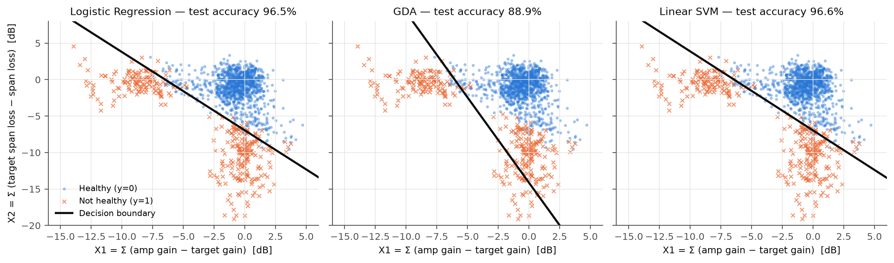

# Link Failure Prediction & Localization in Cloud-Scale Networks using Supervised Learning

**UE24CS352A Machine Learning: Mini-Project**  
Team: J Sanjay Varma (PES1UG24CS194) · Kanak Pandey (PES1UG24CS212)

This project reproduces and extends *Z. Bakhtiari, "Link Failure Prediction and Localization in Cloud Scale
Networks using Supervised Learning"*. Optical-line telemetry (span loss and amplifier gain against their
targets) is used to classify an end-to-end (E2E) link as **healthy** or **not healthy**. A second stage then
**localizes** the faulty span and element, detects **flapping** links, and measures how early the classifier
warns before an outage.

| | Paper | This project (held-out test set, 1500 samples) |
|---|---|---|
| Logistic Regression (Newton's method) | 99 % | **96.5 %** (AUC 0.995) |
| GDA | 97 % | **88.9 %** (AUC 0.964) |
| Linear SVM | 99 % | **96.6 %** (AUC 0.995) |
| SVM, RBF kernel *(extension)* | not tried | 97.2 % |
| LR + 38 per-span features *(extension)* | not tried | 97.4 % |
| Fault localisation (span + element) | not quantified | 100 % on detected failures |

The ranking matches the paper: LR ≈ Linear SVM > GDA. Section *Results* below explains why the absolute numbers
differ.

---

## 1. Setup

You need Python 3.10 or newer.

```bash
git clone <this-repo-url>
cd <repo-folder>
python3 -m venv .venv
source .venv/bin/activate          # Windows: .venv\Scripts\activate
pip install -r requirements.txt
```

## 2. Run

```bash
python run_pipeline.py             # generate data -> preprocess -> train -> evaluate (about 20 s)
```

This writes:

| Output | Content |
|---|---|
| `data/raw/telemetry.csv.gz` | 114 000 raw telemetry rows (20 links × 19 spans × 300 two-minute bins) |
| `data/raw/link_health.csv` | OSNR, Rx power, label and ground-truth fault for every link and bin |
| `data/processed/features.csv` | the 6000 × (X1, X2, y) training table |
| `data/processed/span_residuals.csv` | per-span residuals used for localisation |
| `models/*.joblib` | the three trained classifiers |
| `results/metrics.json`, `results/summary.md` | all metrics |
| `results/figures/*.png` | all plots used in the report and slides |

You can also run one stage at a time with `python run_pipeline.py --step generate|preprocess|train`.

### Interactive demo (for the live review)

```bash
streamlit run app.py
```

* **Fault injection:** choose a fault type, span and severity. The app shows the physical OSNR, the
  prediction from each model, where the snapshot falls relative to the three decision boundaries, and the
  localised span.
* **Network replay:** 10 hours of telemetry for any link, with out-of-fold predictions and flapping alarms.
* **Model performance:** the metrics table and all figures.

### Command-line prediction

```bash
python predict.py --snapshot examples/degraded_span7.csv
python predict.py --x1 -0.5 --x2 -9.0
```

### Tests

```bash
pytest -q          # 12 tests: models vs. scikit-learn, physics, preprocessing, localisation
```

---

## 3. Problem statement

Cloud providers run IP-over-optical networks in which every E2E link crosses many fibre spans and inline
amplifiers. A fibre that slowly gets lossier or an amplifier that loses gain lowers the optical signal-to-noise
ratio (OSNR) until traffic fails. The goal is to **detect marginal or failing links from routine telemetry
before customers see an outage**, and to **tell field engineers which span to fix**.

## 4. Dataset

The paper used live data from a production time-series database, which has not been published (the
appendix link returns 404). We therefore wrote a **physics-based telemetry simulator**
(`linkfail/simulator.py`) that reproduces the paper's data format exactly:

* 10 fibre routes × 2 traffic directions = **20 E2E links**, each with **19 spans**
* 4 raw metrics per span every **2 minutes**: span loss, target span loss, amplifier gain, target gain
* **6000 samples** in total (300 bins per link), split **75 / 25** into 4500 training and 1500 test samples
* Faults are injected with ground-truth location. Slow faults ramp up gradually and others are abrupt steps:
  * fibre degradation (1–14 dB, sometimes partly compensated by the amplifier)
  * amplifier gain degradation (1–12 dB, with a higher noise figure)
  * flapping connector
  * fibre cut
* **Labels come from OSNR, as in the paper.** The generalised OSNR is computed with an ASE + GN-model
  nonlinear-noise link budget. A sample is *not healthy* if any of these holds:
  * OSNR < 17 dB
  * received power is more than 7 dB below nominal
  * the receiver has loss of signal
* The telemetry is noisy and incomplete:
  * measurement noise of 0.12 dB on loss and 0.06 dB on gain
  * about 2 % of cells missing at random
  * occasional whole bins missing
  * no loss reading during a fibre cut (loss-of-signal alarm instead)

Result: 24.5 % of samples are not healthy (fibre degradation 1538, amplifier 1165, flapping 368, fibre cut
224 bins).

## 5. Approach

**Preprocessing** (`linkfail/preprocessing.py`, paper §III)
1. Loss readings missing because of a fibre cut are filled with the expected cut value (target + 40 dB).
2. Every other gap is filled by linear interpolation between neighbouring bins, separately for each link
   (traffic direction) and span.
3. Per-span differences (Eq. 1): `x1 = amp_gain − target_gain`, `x2 = target_span_loss − span_loss`.
4. E2E aggregation (Eq. 2): `X1 = Σ x1`, `X2 = Σ x2` over the 19 spans.

**Classifiers** (`linkfail/models.py`, paper §IV, written from scratch in NumPy)
* **Logistic regression** minimises the cross-entropy J(θ) of Eq. 3 with **Newton's method**, using the
  Hessian `XᵀSX/n`. It converges in about 11 iterations.
* **GDA** uses the closed-form maximum-likelihood estimates of φ, μ₀, μ₁ and a shared Σ (Eq. 4), which gives
  a linear boundary at p(y|x) = 0.5.
* **Linear SVM** minimises the soft-margin hinge loss in the primal, using the mini-batch **Pegasos**
  sub-gradient solver with iterate averaging.
* Each model is checked against scikit-learn: LR agrees on 99.8 % of test predictions, GDA and SVM on 100 %.

**Localisation and operations** (`linkfail/localization.py`)
* The faulty element is the span with the largest positive residual, where the residual is
  `span_loss − target` for fibre and `target_gain − gain` for amplifiers. A residual of 25 dB or more is
  reported as a fibre cut.
* A link is reported as **flapping** when its predicted health toggles 4 or more times within 30 minutes.
* **Early warning:** for each degradation that ends in an outage, we measure how far ahead of the outage the
  classifier first raised an alarm.

## 6. Results



| Classifier | Accuracy | Precision | Recall | F1 | AUC | 5-fold CV | Unseen routes |
|---|---|---|---|---|---|---|---|
| Logistic Regression | 96.47 % | 0.927 | 0.929 | 0.928 | 0.995 | 96.95 ± 0.66 % | 96.88 ± 0.80 % |
| GDA | 88.93 % | 0.935 | 0.589 | 0.722 | 0.964 | 89.93 ± 1.02 % | 89.90 ± 2.94 % |
| Linear SVM | 96.60 % | 0.927 | 0.935 | 0.931 | 0.995 | 96.95 ± 0.62 % | 96.92 ± 0.77 % |

Model coefficients (raw dB units; decision rule θ0 + θ1·X1 + θ2·X2 ≥ 0 means *not healthy*):

| Classifier | θ0 | θ1 | θ2 |
|---|---|---|---|
| Logistic Regression | −10.44 | −1.61 | −1.50 |
| GDA | −5.73 | −0.95 | −0.41 |
| Linear SVM | −6.18 | −0.96 | −0.89 |

For LR and SVM, θ1 ≈ θ2, so the learnt rule is roughly *"alarm when the net power deficit X1 + X2 falls below
about −7 dB."* This is the physically correct rule.

**Localisation:** span and element are 100 % correct on detected failures (n = 341). Over every sample that has
a fault, including minor faults still labelled healthy, span accuracy is 91.6 %. A learnt multinomial-LR
localiser reaches 99.7 %.
**Flapping:** all 9 of 9 flapping events are detected, with a 7 % false-alarm rate on other bins.
**Early warning:** all 18 degradations that ended in an outage were flagged no later than the outage. 12 of
them were flagged before it, with a mean lead time of 8 minutes.

### Why our numbers are lower than the paper's, and why GDA trails

* Summing over 19 spans throws away **where** the loss happened. A 7 dB deficit in span 1 degrades the OSNR of
  all 19 downstream amplifiers, while the same deficit in span 19 affects only one. Points near the boundary
  are therefore truly ambiguous in (X1, X2). Adding the 38 per-span residuals raises LR to 97.4 %, and an RBF
  SVM reaches 97.2 %. So most of the remaining error comes from this information loss, not from the linear
  model.
* GDA assumes each class is a single Gaussian with a shared covariance. The *not healthy* class is
  multi-modal, with separate gain-loss, fibre-loss and fibre-cut clusters (the cuts sit at X2 ≈ −40 dB). That
  stretches Σ and tilts the boundary, so recall falls to 0.59. The paper also found GDA in last place, for the
  same reason.

---

## 7. Repository layout

```
├── run_pipeline.py          # one-command experiment
├── app.py                   # Streamlit live demo
├── predict.py               # CLI inference on a snapshot
├── linkfail/
│   ├── config.py            # paths, physical constants, thresholds
│   ├── simulator.py         # telemetry generator + optical link budget
│   ├── preprocessing.py     # wrangling, Eq.1 / Eq.2 features
│   ├── models.py            # LR-Newton, GDA, Pegasos linear SVM (from scratch)
│   ├── localization.py      # span localisation + flapping detection
│   ├── evaluation.py        # metrics, early-warning lead time
│   ├── plots.py             # figures
│   └── pipeline.py          # orchestration, CV, extensions, artefacts
├── tests/                   # pytest suite
├── examples/                # sample telemetry snapshots for predict.py
├── data/, models/, results/ # generated artefacts (committed for convenience)
└── docs/                    # write-up (PDF), slide deck (PPTX) and their build scripts
```

## 8. Deliverables

* **Write-up (PDF):** `docs/Writeup_Link_Failure_Prediction.pdf`
* **Slides:** `docs/Slides_Link_Failure_Prediction.pptx`
* Rebuild both after re-running the pipeline with `python docs/build_writeup.py && python docs/build_slides.py`

## 9. Team & contributions

| Member | Contributions |
|---|---|
| J Sanjay Varma (PES1UG24CS194) | Telemetry simulator and optical link budget, preprocessing and feature engineering, localisation and flapping detection, Streamlit demo |
| Kanak Pandey (PES1UG24CS212) | Logistic regression (Newton), GDA and Pegasos SVM implementations, evaluation (CV, ROC, early warning), extensions, write-up and slides |


## Reference

Z. Bakhtiari, "Link Failure Prediction and Localization in Cloud Scale Networks using Supervised Learning,"
Stanford University.
